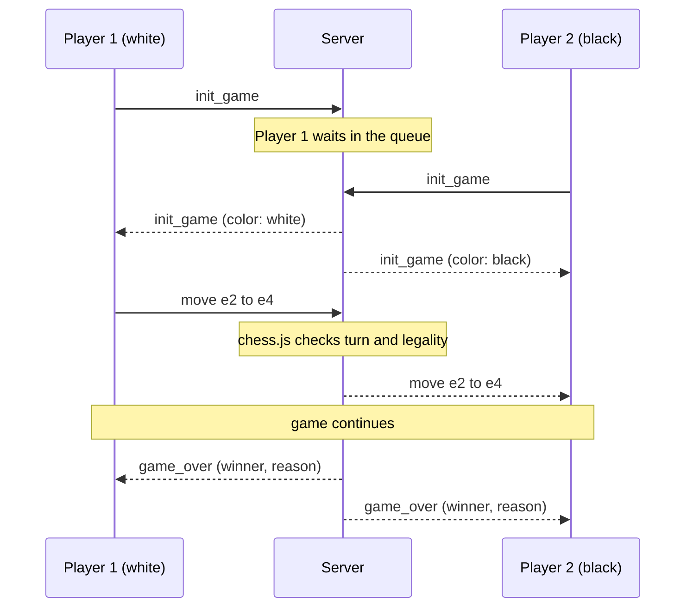

<div align="center">


# DevChess

**Real-time multiplayer chess in your browser. Click play, get matched, make your move.**

[](https://devchess-f8qw.onrender.com/)


</div>

<!-- Record a short GIF of a game (or take a screenshot), save it as docs/demo.gif, then uncomment: -->
<!--  -->

## About

DevChess pairs you with another player in seconds and streams every move over WebSockets. There's no sign-up: open the site, press **Play now**, and you're in a game.

The server acts as the referee. Every move is checked for turn order and legality with chess.js before it reaches your opponent, so a modified client can't play illegal moves or move out of turn.

> **Playing solo?** Open the site in two browser windows and click **Find Match** in both. They'll be paired with each other.

> **Heads up:** the backend runs on Render's free tier and sleeps when idle, so the first connection can take up to a minute. The client retries automatically.

## Features

**Gameplay**
- Instant matchmaking: the first two players in the queue are paired, and the first to join plays white
- Click-to-move with legal-move hints; the board flips when you play black
- Full chess rules including castling, en passant and promotion (auto-queen for now)
- Game-over detection for checkmate, stalemate, threefold repetition, insufficient material and the 50-move rule
- Win by forfeit if your opponent disconnects

**Engineering**
- Server-authoritative game state: the client is never trusted
- Every incoming message is validated against a Zod schema, and payloads are capped at 1 KB
- Ping/pong heartbeat every 30 s detects dead connections and ends their games cleanly
- Client reconnects automatically with exponential backoff (1 s up to 10 s) to ride out cold starts
- Finished games are removed from memory immediately

**Interface**
- The landing page replays Byrne vs. Fischer, *The Game of the Century* (New York, 1956), with pieces that glide between squares
- The board morphs between pages using the View Transitions API
- Interactive dot-field background that reacts to the cursor
- Respects `prefers-reduced-motion`, and the replay pauses in background tabs

## Tech stack

| Layer | Technology |
| --- | --- |
| Frontend | React 19, TypeScript, Vite 7, Tailwind CSS 3, React Router 7, GSAP |
| Backend | Node.js 20+, `ws`, Zod |
| Chess rules | chess.js (on both client and server) |
| Hosting | Render |

## How it works



The client applies each move locally first so it feels instant, then sends it to the server. The server re-validates it against its own copy of the board and only then forwards it to the opponent. Invalid or out-of-turn moves are dropped.

### Message protocol

All messages are JSON over a single WebSocket connection.

| Direction | Example |
| --- | --- |
| Client → Server | `{ "type": "init_game" }` |
| Client → Server | `{ "type": "move", "move": { "from": "e7", "to": "e8", "promotion": "q" } }` |
| Server → Client | `{ "type": "init_game", "payload": { "color": "white" } }` |
| Server → Client | `{ "type": "move", "payload": { "from": "e2", "to": "e4" } }` |
| Server → Client | `{ "type": "game_over", "payload": { "winner": "black", "reason": "checkmate" } }` |

`promotion` is optional and is one of `q`, `r`, `b`, `n`. `reason` is one of `checkmate`, `stalemate`, `repetition`, `insufficient_material`, `fifty_moves` or `opponent_left`. `winner` is `null` for draws.

## Getting started

**Prerequisites:** Node.js 20 or newer and npm.

```bash
git clone https://github.com/DevdharManpuria/chess.git
cd chess

# Terminal 1: backend, listens on ws://localhost:8080
cd backend1
npm install
npm run dev

# Terminal 2 (from the repo root): frontend, runs on http://localhost:5173
cd frontend
npm install
npm run dev
```

The frontend connects to `ws://localhost:8080` by default, so you don't need a `.env` file for local development.

### Environment variables

| Variable | App | Default | Description |
| --- | --- | --- | --- |
| `VITE_WS_URL` | frontend | `ws://localhost:8080` | Backend WebSocket URL. Must use `wss://` in production. Baked in at build time. |
| `PORT` | backend | `8080` | Port for the HTTP and WebSocket server. Render sets this automatically. |

See [`frontend/.env.example`](frontend/.env.example).

### Scripts

| Folder | Command | Description |
| --- | --- | --- |
| `backend1` | `npm run dev` | Start the server with hot reload |
| `backend1` | `npm run build` | Compile TypeScript to `dist/` |
| `backend1` | `npm start` | Run the compiled server |
| `frontend` | `npm run dev` | Start the Vite dev server |
| `frontend` | `npm run build` | Type-check and build to `dist/` |
| `frontend` | `npm run lint` | Run ESLint |

## Deployment

Both halves are deployed on Render.

**Backend (Web Service)**
- Root directory: `backend1`
- Build command: `npm install && npm run build`
- Start command: `npm start`

**Frontend (Static Site)**
- Root directory: `frontend`
- Build command: `npm install && npm run build`
- Publish directory: `dist`
- Environment variable: `VITE_WS_URL=wss://<your-backend>.onrender.com`
- Rewrite rule: source `/*`, destination `/index.html`, action **Rewrite**, so refreshing `/game` doesn't 404

## Project structure

```
.
├── backend1/
│   └── src/
│       ├── index.ts          # HTTP + WebSocket server, heartbeat
│       ├── GameManager.ts    # matchmaking queue, message routing, disconnects
│       ├── Game.ts           # a single match: turn checks, validation, results
│       └── messages.ts       # message types and Zod schemas
└── frontend/
    ├── public/               # chess piece SVGs
    └── src/
        ├── screens/          # Landing and Game pages
        ├── components/       # ChessBoard, HeroBoard, DotField, PillNav
        ├── hooks/            # useSocket (auto-reconnect), useReplay
        └── data/             # Game of the Century move list
```

## Roadmap

- [ ] Player accounts and Elo ratings
- [ ] Promotion picker (currently auto-queens)
- [ ] Time controls and clocks
- [ ] Move list with PGN export
- [ ] Resign and draw offers
- [ ] Rejoin a game after a refresh or dropped connection
- [ ] Persist games in a database (state is currently in memory)
- [ ] Unit tests for `Game` and `GameManager`

## Contributing

Issues and pull requests are welcome. For bigger changes, please open an issue first.

1. Fork the repo and create a branch: `git checkout -b feat/your-change`
2. Keep the server authoritative: rule and state changes belong in `backend1/src/Game.ts` or `GameManager.ts`
3. If you change the protocol, update both `backend1/src/messages.ts` and the message constants in `frontend/src/screens/Game.tsx`
4. Run `npm run lint` and `npm run build` in `frontend/` before opening a PR

## Acknowledgements

- [chess.js](https://github.com/jhlywa/chess.js) for move generation and validation
- [React Bits](https://reactbits.dev) for the DotField and PillNav components
- Piece set by [AUTHOR](LINK)
- Donald Byrne vs. Bobby Fischer, New York 1956, for the landing-page replay

## License

Released under the [MIT License](LICENSE).

## Author

**Devdhar Manpuria** · [GitHub](https://github.com/DevdharManpuria) · [LinkedIn](https://www.linkedin.com/in/devdharmanpuria/) · [LeetCode](https://leetcode.com/u/DevGamesdtn/)